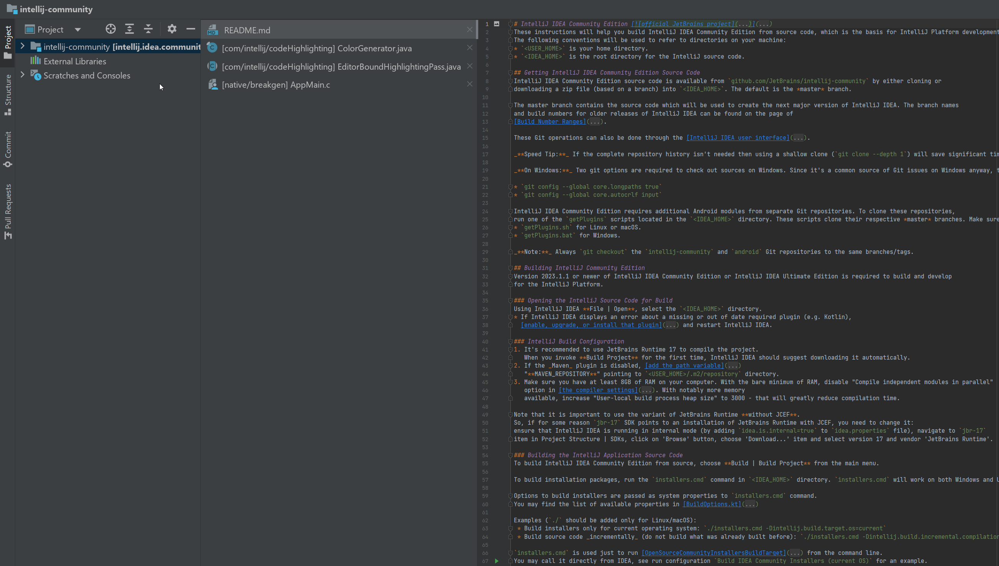

# Tabdir Redux

This plugin will allow you to have directory names added to tab labels, and use various ways to shorten them, including regex.

This is an updated and extended fork of IntelliJ plugin **Tabdir**, originally found at [crazyproger/Tabdir](https://github.com/crazyproger/Tabdir) and IntelliJ Plugin Marketplace [here](https://plugins.intellij.net/plugin/?idea&id=5045).

You can install this fork of the plugin from the IntelliJ Marketplace [here](https://plugins.jetbrains.com/plugin/24528-tabdir-redux). You will have to uninstall the old version first.

## Screenshots

## Description

Awesome replacement for IDEA's 'Show directory in editor tabs for non-unique filenames'. This plugin will allow you to have directory names
added to tab labels. It can also show only path differences, so if you have `blog/controllers/index` and `news/controllers/index`, it will
add either `[blog]` or `[news]`. You can control how prefixes will be formatted in Settings tab 'Tabdir'.

Tip: If you're having trouble managing dozens of open files, try enabling vertical tabs and 'Sort tabs alphabetically'.

## Features

* add file's path to tab title
* shorten the file's path in table title, limit folder name length and number of nested folders
* configure different tab prefixes for any folder
* set empty path prefixes - if the file's path is shortened to an empty string, e.g. file is at top level of a folder, you can assign it a
  custom prefix to keep these files ordered together
* regex replacements for tab titles

## Configuration

Per-project configuration allows specifying different formatting rules for each directory in project.

To enable per-project configuration, enable "Use per project configuration" checkbox and reopen settings window (needs close with Ok or
Apply buttons). After this you will find 'Tabdir Project Settings' configuration in "Other Settings".

Note: you should turn off IDE Settings → Editor tabs → Show directory in editor tabs for non-unique filenames.
