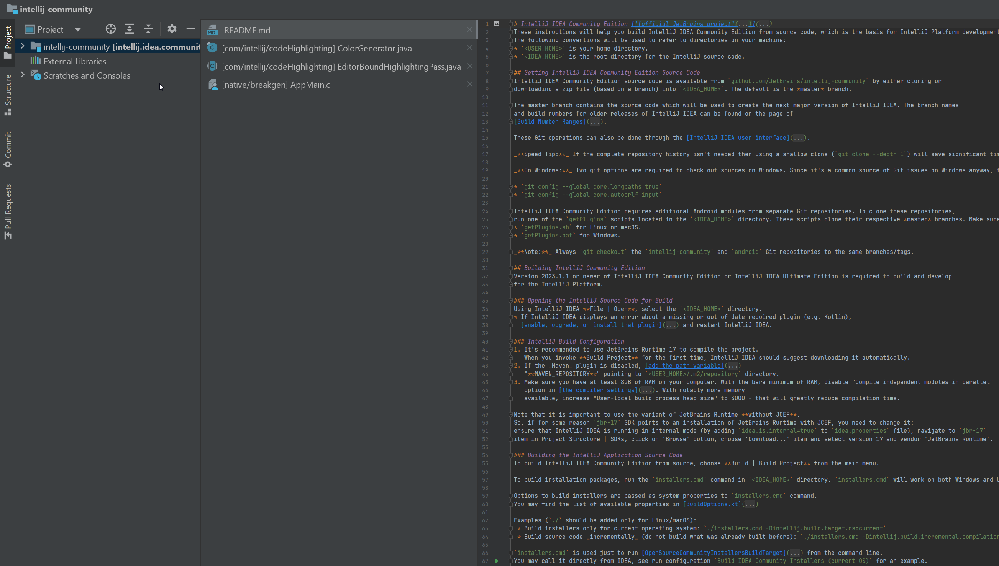

# Tabdir Redux

This plugin will allow you to have directory names added to tab labels, and use various ways to shorten them, including regex.

This is an updated and extended fork of IntelliJ plugin **Tabdir**, originally found at [crazyproger/Tabdir](https://github.com/crazyproger/Tabdir) and IntelliJ Plugin Marketplace [here](https://plugins.intellij.net/plugin/?idea&id=5045).

You can install this fork of the plugin from the IntelliJ Marketplace [here](https://plugins.jetbrains.com/plugin/24528-tabdir-redux). You will have to uninstall the old version first.

## Screenshots

## Description

Awesome replacement for IDEA's 'Show directory in editor tabs for non-unique filenames'. This plugin will allow you to have directory names added to tab labels. It can also show only path differences, so if you have `blog/controllers/index` and `news/controllers/index`, it will add either `[blog]` or `[news]`. You can control how prefixes will be formatted in Settings tab 'Tabdir'.

Tip: If you're having trouble managing dozens of open files, try enabling vertical tabs and 'Sort tabs alphabetically'.

## Features

* add file's path to tab title
* shorten the file's path in table title, limit folder name length and number of nested folders
* configure different tab prefixes for any folder
* set empty path prefixes—if the file's path is shortened to an empty string, e.g., the file is at the top level of a folder, you can assign it a custom prefix to keep these files ordered together
* regex replacements for tab titles

## Configuration

Per-project configuration allows specifying different formatting rules for each directory in project.

To enable per-project configuration, enable "Use per project configuration" checkbox and reopen the `Settings` window (needs close with `Ok` or `Apply` buttons). After that, you will find 'Tabdir Project Settings' configuration in "Other Settings".

Note: you should turn off IDE Settings → Editor tabs → Show directory in editor tabs for non-unique filenames.

## Usage notes

- There is some weirdness around the global configuration, so create at least one Per project configuration and set its `Configuration for directory` and `Always show path relative to` to your project's folder.
- If the path (`[{0}]`) part after the tab title replacement ends up empty, nothing in `[]` brackets is shown, so use unique `Empty path replacement` to differentiate the folders. `Empty path replacement` will be prepended to the filename.
- Use e.g. a `space` or some special character as `Empty path replacement` for your project's root folder, that way you can keep all the files in root together.
- Regex title replacements work on full tab title you get after the Tab title format (`[{0}] $1` by default, which means `[folder] filename`). The regex is in `java.util.regex` format, regexes are newline delimited and `::` separated strings of `match::replacement`.
- You can use any Java's regex syntax tricks, e.g., capture groups in both match and replacement, so running e.g. `app/(.*)/routes/(.*)\.ts::foo $1 $2` on `app/web/routes/my-route.ts` will end up with `foo web my-route`.
- regex results are chained, the result of a first regex is an input for the second one, and so on, and run top to bottom, so you can run multiple regexes on the same title. As a result, you have to take care about unexpected matches and replacements.
- if the opened file is outside your project, the directory won't be shown unless you configure `Tabdir Project Settings` and add folder for e.g. the root of the drive the file is in - for example, Configuration for directory: `C:\`, Always show path relative to: `C:\`, Tab title format: `[C:/{0}] {1}`, Reduce dir names: unchecked.
- to show tab title format changes for the already open files, you will either have to reopen the files, or change Tabs placement (`Settings -> Editor -> General -> Editor Tabs`), from e.g., `Left` to `Top`, click `Apply`, and then set it back to your preference and click `Ok` (haven't found a better way to update the tab titles yet, sorry).
